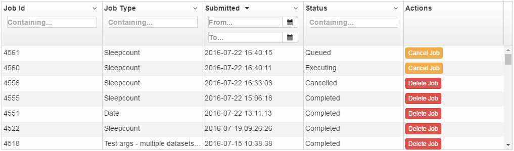
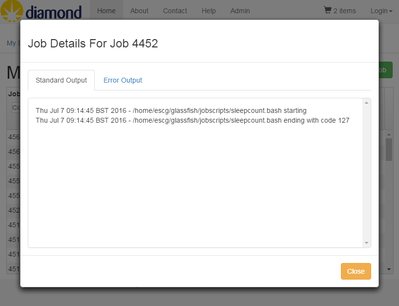
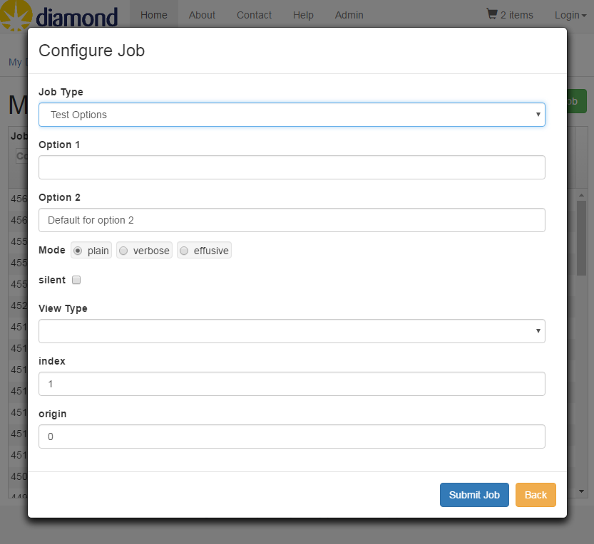
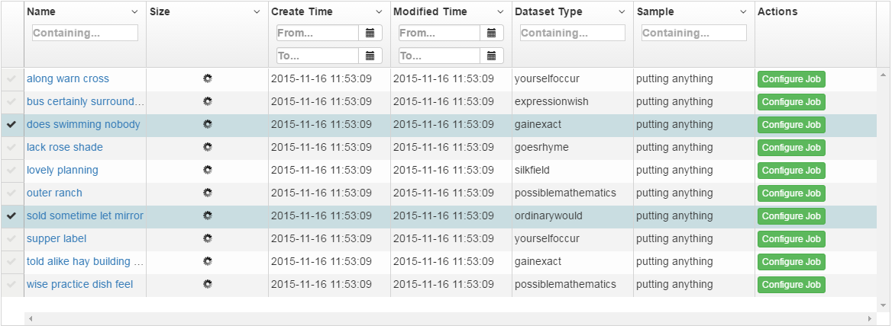
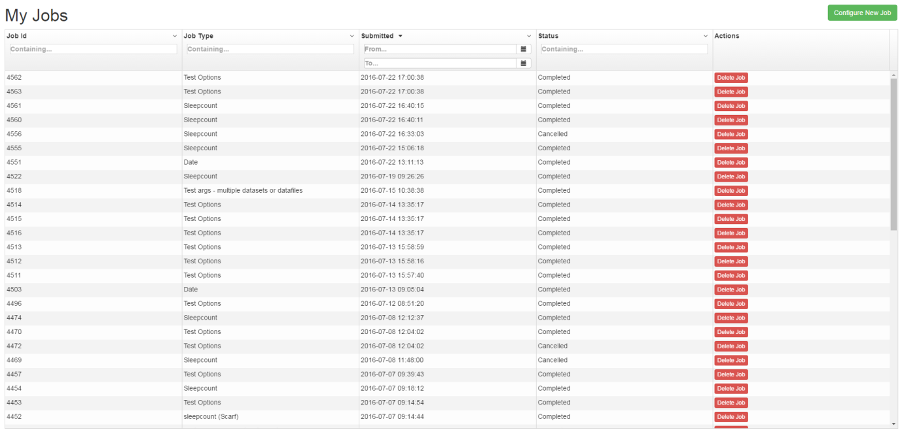
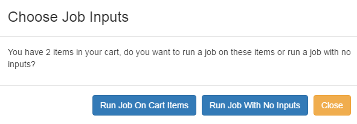

# Topcat IJP Plugin

A Topcat plugin that enables the configuration and submission of jobs to the ICAT Job Portal on data viewed in Topcat. 

## Configuration

This plugin requires some additional configuration options in **topcat.json** and some additional translation strings in **lang.json**.

### topcat.json

The following configuration options are added within the existing 'facilities' attribute in topcat.json

```
  {    
      "facilities": [
          {
              "ijpUrl": "https://example.com"
              "browse":{
                  "entity": {
                       "enableConfigureJob": true
                       "gridOptions": {
                           "externalSelectFilters": {
                               "enableJobTypeFilter": true
                               "filters": [{
                                   "field": "datasetType.name"
                               },
                               {
                                   "field": "dataset.name"
                               }]
                           }
                       }
                  }
              }
          }
      ]
  }
```
the above attributes are defined as: 

  * "facilities"
    * [facility]
      * "**ijpUrl**" - a URL to a valid IJP REST API.
      * "browse"
        * "entity" - an entity (dataset, datafile, investigation etc.)
          * "**enableConfigureJob**" - specifies whether you are able to configure a job on a single specific entity via a button in the 'Browse' table. Can be true or false. Is only applicable to datasets or datafiles.
          * "gridOptions"
            * "**externalSelectFilters**"
              * "**enableJobTypeFilter**" - specifies whether there should be a select box containing all IJP job types above the 'Browse' grid. Can be true or false. Only applicable to datasets.
              * "**filters**" - an array containing all the select boxes to be shown.
                * "**field**" - the field that should be displayed in the select box. Can use Topcat defined jpql variables.

### lang.json

Some of the additional translation strings required for this plugin are included within the existing hierarchy in lang.json and are as follows:

```
{
  "MAIN_NAVIGATION": {
    "MAIN_TAB": {
      "MY_JOBS": "My Jobs"
    }
  },
  "CART": {
    "CONFIGURE_JOB_BUTTON" : {
      "TEXT" : "Configure Job",
      "TOOLTIP" : {
        "TEXT" : "Click to configure and run a job on the cart items"
      }
    },
    "CONFIGURE_JOB_MULTI_FACILITY_BUTTON" : {
      "TEXT" : "Configure Job ({{facilityTitle}})",
      "TOOLTIP" : {
        "TEXT" : "Click to configure and run a job on the cart items for this facility"
      }
    }
  }
}

```
The rest of the translation strings can be appended to the lang.json file and are:

```
    "MY_JOBS" : {
        "TITLE" : "My Jobs",
        "NO_RESULTS" : "You do not have any jobs",
        "LOADING" : "Loading - please wait",
        "NO_IJP" : "There is no ICAT Job Portal defined for this facility",
        "COLUMN": {
            "JOB_ID": "Job Id",
            "NAME": "Job Type",
            "DATE": "Submitted",
            "STATUS": "Status",
            "ACTIONS": {
              "NAME": "Actions",
                "BUTTON" : {
                    "DELETE_JOB" : {
                      "TEXT" : "Delete Job",
                      "TOOLTIP" : {
                        "TEXT": "This will permanently delete this job"
                      }
                    },
                    "CANCEL_JOB" : {
                      "TEXT" : "Cancel Job",
                      "TOOLTIP" : {
                        "TEXT": "This will cancel this job, it cannot be restarted"
                      }
                   }
                }
            }
        },
        "BUTTON" : {
            "CONFIGURE_JOB" : {
                "TEXT" : "Configure New Job"
            },
            "CONFIGURE_JOB_DROPDOWN" : {
                "TEXT" : "Configure New Job ",
                "TOOLTIP" : {
                    "TEXT" : "Click to configure a job for a certain facility"
                }
            }
        },
        "JOB_DETAILS" : {
            "MODAL" : {
                "TITLE" : "Job Details For Job {{jobId}}",
                "IS_LOADING": "Loading standard output...",
                "NO_OUTPUT": "There is no standard output for this job",
                "TABS" : {
                    "STANDARD_OUTPUT": "Standard Output",
                    "ERROR_OUTPUT": "Error Output"
                },
                "BUTTON" : {
                    "CLOSE" : {
                        "TEXT" : "Close"
                    }
                }
            }
        },
        "CHOOSE_JOB_INPUTS" : {
            "MODAL" : {
                "TITLE" : "Choose Job Inputs",
                "INPUT_CHOICE_MESSAGE" : "You have {{numCartItems}} items in your cart, do you want to run a job on these items or run a job with no inputs?",
                "BUTTON" : {
                    "CLOSE" : {
                        "TEXT" : "Close"
                    },
                    "CART_INPUT" : {
                        "TEXT" : "Run Job On Cart Items"
                    },
                    "NO_INPUT" : {
                        "TEXT" : "Run Job With No Inputs"
                    }
                }
            }
        }
    },
    "CONFIGURE_JOB" : {
        "MODAL" : {
            "TITLE" : "Configure Job",
            "SINGLE_JOB_TYPE" : {
                "TITLE" : "Job Type: {{jobName}}"
            },
            "JOB_TYPES_LOADING_MESSAGE" : "Loading compatible job types...",
            "NO_JOB_TYPES_MESSAGE" : "There are no job types compatible with this input",
            "NO_JOB_OPTIONS_MESSAGE" : "There are no configuration options for this job type",
            "ERROR" : {
                "REQUIRED" : "This field is required",
                "INTEGER" : "This field must be an integer",
                "FLOAT" : "This field must be a number",
                "MAX" : "This field must be between {{min}} and {{max}}",
                "MIN" : "This field must be between {{min}} and {{max}}"
            },
            "SELECT_LABEL" : {
                "JOB_TYPE" : "Job Type"
            },
            "BUTTON" : {
                "SUBMIT_JOB" : {
                    "TEXT" : "Submit Job"
                },
                "SUBMIT_MULTIPLE_JOBS" : {
                    "TEXT" : "Submit Multiple Jobs",
                    "TOOLTIP" : {
                        "TEXT" : "NOTE: This will submit {{numJobs}} jobs, one for each cart item. "
                    }
                },
                "CLOSE" : {
                    "TEXT" : "Back"
                }
            }
        }
    },
    "CONFIRM_JOB" : {
        "MODAL" : {
            "TITLE" : "Confirm Submission",
            "JOBS_CHOICE_MESSAGE" : "Please select whether you would like to submit a single job for all cart items or {{numJobs}} separate jobs (one for each cart item).",
            "BUTTON" : {
                "SUBMIT_MULTIPLE_JOBS" : {
                    "TEXT" : "Submit Multiple Jobs"
                },
                "SUBMIT_SINGLE_JOB" :  {
                    "TEXT" : "Submit Single Job"
                },
                "CLOSE" : {
                    "TEXT" : "Cancel"
                }
            }
        }
    },
    "SUBMITTING_JOB" : {
        "MODAL" : {
            "TITLE" : "Job Submission",
            "SUBMITTING_JOB_MESSAGE" : "Submitting - please wait...",
            "BATCH_SUBMISSION_SUCCESSFUL_MESSAGE" : "Job submitted successfully with job ID {{jobId}}",
            "BATCH_SUBMISSIONS_SUCCESSFUL_MESSAGE" : "Jobs submitted successfully with job IDs {{jobIds}}",
            "WIN_INTERACTIVE_SUBMISSION_SUCCESSFUL_MESSAGE" : "Interactive job submitted successfully. A .rdp file should download, open it in Remote Desktop and enter the password below. If no file is downloaded, please start Remote Desktop and manually enter the following values:",
            "UNIX_INTERACTIVE_SUBMISSION_SUCCESSFUL_MESSAGE" : "Interactive job submitted successfully. Please paste the following into a terminal:",
            "SUBMISSION_FAILED_MESSAGE" : "One or more job submissions failed: ",
            "COLUMN" : {
                "INPUT_ENTITY_IDS" : "Input Entity Ids",
                "ERROR_MESSAGE" : "Error response"
            },
            "BUTTON" : {
                "CLOSE" : {
                    "TEXT" : "Back"
                }
            }
        }
    },
    "CONFIGURE_JOB_ENTITY_ACTION_BUTTON": {
        "TEXT": "Configure Job",
        "TOOLTIP": {
            "TEXT": "Click to configure a job on this entity"
        }
    },
    "SELECT_FILTERS": {
        "FILTER_TEXT": "Filter by {{filterName}}...",
         "DATASET": {
             "DATASET_TYPE": "dataset type"
         },
         "JOB_TYPE": {
             "NAME": "job type"
         }
    },

```

You can also add a guide specific to the IJP plugin to the 'Help' page by appending the following to the existing HELP > HTML attribute in lang.json

```
<div>\n    <h1 class=\"page-header\">My Jobs</h1>\n\n    <p>In the <a ui-sref=\"home.my-jobs\">My Jobs</a> tab you can view all your submitted batch jobs in a table. You can quickly see the current status of your jobs in the Status column, which is updated every 30 seconds. Depending on the status of a job, you can perform different actions on that job, such as deleting or cancelling it, by clicking on a button in the Actions column. Note: these actions are permanent!</p>  <p></p>  <p>\n\n    Click on a row of the table to open a popup with tabs showing the standard and error output (if there is any) for that job. </p> <p></p></div>    <div><p><h1 class=\"page-header\">Configuring And Submitting Jobs</h1></p>  <p><h3>For a selection of datasets/datafiles</h3></p>  <p>To configure and run a job on a selection of datasets and/or datafiles, first put them in your cart. In the cart, click the ‘Configure Job’ button to configure a job on these items. A popup will appear with a dropdown box where you can select your desired job type. The list will only show job types that are compatible with all the items in your cart. If the job has any options, you can fill them in, then press the ‘Submit Job’ button. If you have multiple items in your cart, but the job doesn’t accept multiple items then multiple jobs will be submitted automatically. If the job does accept multiple items you will be asked whether you want to submit one job or multiple jobs.</p>  <p></p>  <p>If the submitted job(s) are batch jobs a message will appear informing you of the job IDs, you can now view these jobs in the ‘My Jobs’ page. </p>  <p></p>  <p>If the submitted job is an interactive job, you will get a message with instructions on how to access your interactive session.</p>  <p><h3>For a single dataset/datafile</h3></p>  <p>To run a job without any input datasets or datafiles, go to the ‘My Jobs’ page and click on the green ‘Configure New Job’ button in the top right.</p>  <p></p></div>  <p><h3>With no input datasets/datafiles</h3></p>  <p>To run a job without any input datasets or datafiles, go to the ‘My Jobs’ page and click on the green ‘Configure New Job’ button in the top right</p>  <p></p>  <p>If there are items in your cart, you will get a popup asking whether you want to run a job on the cart items or not. Choose ‘Run Job With No Inputs’ to run a job without any input datasets or datafiles.</p>  <p></p>
```
## Guide

### My Jobs Page

When you log in to Topcat, you will see an additional 'My Jobs' tab next to the 'My Data' tab.


In the 'My Jobs' tab you can view all your submitted batch jobs in a table. You can quickly see the current status of your jobs in the Status column, which is updated every 30 seconds. Depending on the status of a job, you can perform different actions on that job, such as deleting or cancelling it, by clicking on a button in the Actions column. Note: these actions are permanent!



Click on a row of the table to open a popup with tabs showing the standard and error output (if there is any) for that job.



### Configuring and Submitting Jobs

**For a selection of datasets/datafiles**

To configure and run a job on a selection of datasets and/or datafiles, first put them in your cart. In the cart, click the ‘Configure Job’ button to configure a job on these items. A popup will appear with a dropdown box where you can select your desired job type. The list will only show job types that are compatible with all the items in your cart. If the job has any options, you can fill them in, then press the ‘Submit Job’ button. If you have multiple items in your cart, but the job doesn’t accept multiple items then multiple jobs will be submitted automatically. If the job does accept multiple items you will be asked whether you want to submit one job or multiple jobs.



If the submitted job(s) are batch jobs a message will appear informing you of the job IDs, you can now view these jobs in the ‘My Jobs’ page.


If the submitted job is an interactive job, you will get a message with instructions on how to access your interactive session.

**For a single dataset/datafile**

You can also run a job on a specific dataset or datafile by clicking on the green ‘Configure Job’ button on a row in the ‘Browse’ table, if this has been configured in topcat.json.



**With no input datasets/datafiles**

To run a job without any input datasets or datafiles, go to the ‘My Jobs’ page and click on the green ‘Configure New Job’ button in the top right.



If there are items in your cart, you will get a popup asking whether you want to run a job on the cart items or not. Choose ‘Run Job With No Inputs’ to run a job without any input datasets or datafiles.


